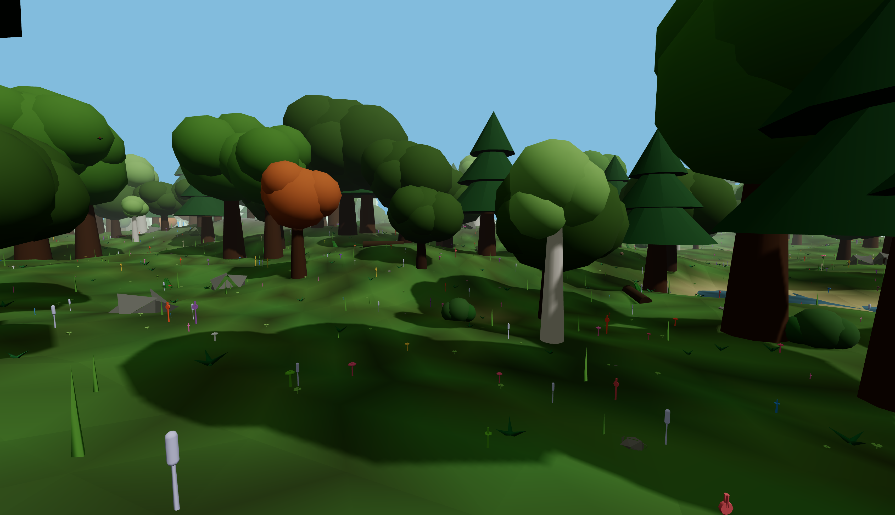
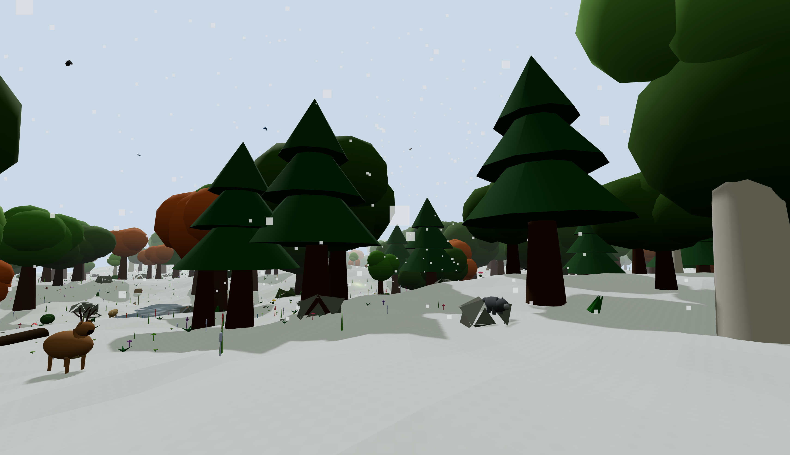
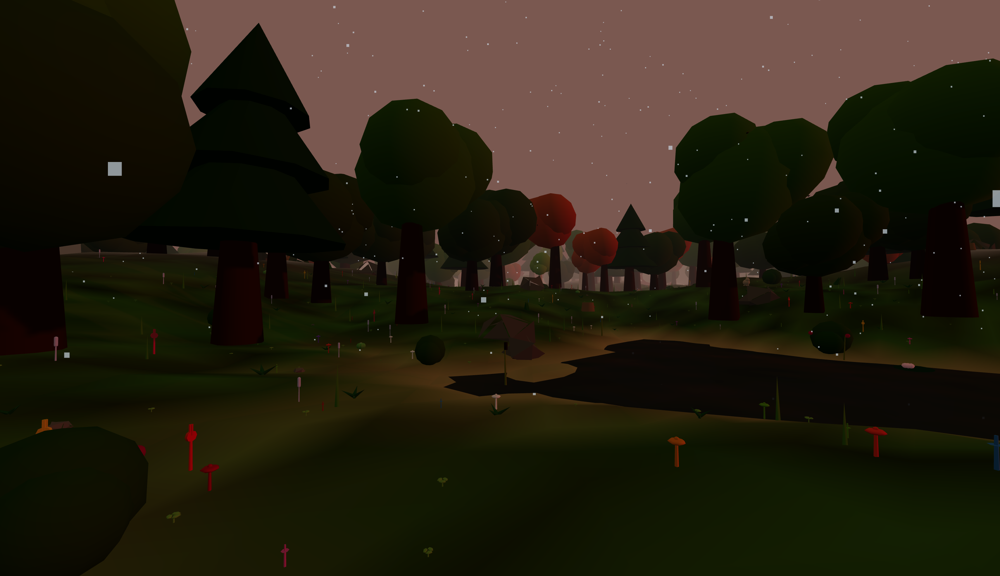

# 🌲 Infinite Forest

[](https://nextjs.org/)
[](https://docs.pmnd.rs/react-three-fiber/)
[](https://www.typescriptlang.org/)
[](LICENSE)

> **Un'esperienza immersiva in prima persona attraverso una foresta infinita, generata proceduralmente. Ogni visita è un mondo unico!**

🎮 **[Prova la Demo Live](https://infinite-forest-demo.vercel.app)** (se deployato)

---

## ✨ Caratteristiche Principali

### 🌍 Generazione Procedurale Infinita
- **Mondo infinito** — Cammina in qualsiasi direzione, il terreno si genera dinamicamente
- **Seed unico ad ogni caricamento** — Ricarica la pagina per un mondo completamente diverso
- **Condivisione mondi** — Usa `?seed=N` nell'URL per condividere un mondo specifico

### 🏔️ 5 Tipi di Terreno
| Terreno | Descrizione | Colore Fogliame |
|---------|-------------|-----------------|
| **Flat** 🌱 | Pianure verdi e colline dolci | Verde naturale |
| **Hilly** ⛰️ | Colline ondulate e valli | Verde leggermente più scuro |
| **Mountainous** 🏔️ | Alpeggi con vegetazione alpina | Verde alpino |
| **Volcanic** 🌋 | Terreno nero con cenere vulcanica | Grigio cenere |
| **Riverlands** 💧 | Fiumi meandranti procedurali | Verde vibrante |

### 🌧️ Sistema Meteo Dinamico
- **Clear** ☀️ — Cielo sereno, sole luminoso
- **Rain** 🌧️ — Pioggia con effetti particellari e nebbia
- **Fog** 🌫️ — Nebbia densa per atmosfera misteriosa  
- **Snow** ❄️ — Neve che ricopre il terreno (shader bianco dinamico)

### 🎭 Sistema NPC (Personaggi Non Giocanti)
- **6 personaggi unici** con modelli 3D distintivi:
  - 🧙‍♂️ Mago — Saggio conoscitore della foresta
  - 👨‍🌾 Contadino — Esperto di piante e raccolto
  - 🧝‍♀️ Elfo — Guardiano della natura
  - ⛏️ Minatore — Cercatore di tesori nascosti
  - 🏃‍♂️ Runner — Avventuriero velocissimo
  - 👸 Principessa — Nobile della foresta
- **Dialoghi contestuali** — Gli NPC parlano del tempo, della fauna, del tuo equipaggiamento
- **Spawn dinamico** — Compaiono in punti strategici della foresta

### 🌿 Ecosistema Vegetale
- **15+ specie vegetali** da collezionare:
  - 🍄 Funghi (Bolete, Chanterelle, Amanita, Morel)
  - 🌲 Alberi (Conifere, Latifoglie, Betulle, Querce, Acero)
  - 🌾 Erbe e fiori (Lavanda, Trifoglio, Felci, Gigli, Fiordalisi)
  - 🌱 Bacche e arbusti
- **Sistema raccolta** — Avvicinati e premi `E` per raccogliere
- **Effetti vento** — Tutta la vegetazione si muove con il vento (shader animato)

### 🦌 Fauna Selvatica
- **Animali che vagano** — Cervi, volpi, conigli, orsi, uccelli
- **Comportamenti autonomi** — Si muovono, pascolano, fuggono
- **Sistema spawner** — Spawn dinamico basato sulla posizione del giocatore

### 🎨 Tecnologia Avanzata
- **Three.js + React Three Fiber** — Rendering 3D ad alte prestazioni
- **Simplex Noise** — Generazione terreno realistica
- **Instanced Rendering** — Migliaia di oggetti con 1 draw call
- **Shader personalizzati** — Neve, vento, effetti atmosferici
- **Collisioni** — Rilevamento terreno e ostacoli
- **Audio spaziale** — Suoni ambientali 3D

---

## 🎮 Controlli

| Tasto | Azione |
|-------|--------|
| `WASD` / `↑↓←→` | Muoviti |
| `Mouse` | Guarda intorno |
| `Shift` | Sprint (corsa veloce) |
| `Space` | Salta |
| `E` | Raccogli pianta vicina / Interagisci con NPC |
| `Esc` | Sblocca cursore |
| `Q` | Apri inventario |
| `1-5` | Seleziona slot inventario |
| `C` | Clicca per raccogliere bacche dalle piante |

---

## 🚀 Installazione & Sviluppo

```bash
# Clona il repository
git clone https://github.com/andreapianidev/infinite-forest.git
cd infinite-forest

# Installa dipendenze
npm install

# Avvia in modalità sviluppo
npm run dev

# Apri http://localhost:3000
```

### Build Produzione
```bash
npm run build
```

### Deploy (Vercel)
```bash
npx vercel
```
Zero configuration — Next.js è auto-rilevato!

---

## 🖼️ Screenshot


*Esplorazione della foresta in terreno collinare*


*Sistema meteo con neve che ricopre il terreno*


*Terreno vulcanico con cenere e vegetazione adattata*

---

## 🤝 Contribuire

**Cerchiamo collaboratori!** Questo è un progetto open source e accogliamo con piacere:

- 🎨 **Artisti 3D** — Nuovi modelli per alberi, animali, NPC
- 💻 **Sviluppatori** — Ottimizzazioni, nuove feature, bugfix
- 🎵 **Musicisti/Sound Designer** — Audio ambientale ed effetti sonori
- 🌍 **Traduttori** — Localizzazione in altre lingue
- 📝 **Game Designer** — Idee per gameplay e meccaniche

### Come contribuire:
1. Forka il repository
2. Crea un branch: `git checkout -b feature/nuova-feature`
3. Committa le modifiche: `git commit -m 'feat: aggiungi nuova feature'`
4. Pusha sul branch: `git push origin feature/nuova-feature`
5. Apri una Pull Request

---

## 🛠️ Stack Tecnologico

- **Framework:** [Next.js 14](https://nextjs.org/) (App Router)
- **3D Engine:** [Three.js](https://threejs.org/) + [React Three Fiber](https://docs.pmnd.rs/react-three-fiber/)
- **UI:** React + CSS Modules
- **State Management:** [Zustand](https://github.com/pmndrs/zustand)
- **Procedural Generation:** [simplex-noise](https://github.com/josephg/noisejs)
- **Audio:** Web Audio API + Howler.js
- **Type Safety:** TypeScript 5

---

## 📁 Struttura del Progetto

```
├── app/                    # Next.js App Router
│   ├── api/npc-chat/       # API per dialoghi NPC (AI)
│   ├── globals.css         # Stili globali
│   ├── layout.tsx          # Root layout
│   └── page.tsx            # Entry point
├── components/             # Componenti React/Three.js
│   ├── Chunk.tsx           # Sistema terreno chunk-based
│   ├── Player.tsx          # Controlli giocatore
│   ├── Forest.tsx          # Gestione vegetazione
│   ├── Animals.tsx         # Sistema fauna
│   ├── Weather.tsx         # Effetti meteo
│   ├── NPCs.tsx            # Personaggi non-giocanti
│   ├── NPCDialog.tsx       # UI dialoghi
│   ├── HUD.tsx             # Interfaccia utente
│   └── ...
├── lib/                    # Logica di gioco
│   ├── noise.ts            # Generazione procedurale
│   ├── world.ts            # Stato mondo & meteo
│   ├── npc.ts              # Profili NPC & dialoghi
│   └── store.ts            # Game state (Zustand)
├── img/                    # Screenshot per README
└── public/                 # Asset statici
```

---

## 🔮 Roadmap

- [ ] Sistema crafting per oggetti raccolti
- [ ] Più tipi di animali con comportamenti complessi
- [ ] Ciclo giorno/notte dinamico
- [ ] Sistema costruzione base-camp
- [ ] Multiplayer cooperativo (WebRTC)
- [ ] Mobile support con touch controls
- [ ] VR support (WebXR)

---

## 📜 Licenza

MIT License — Vedi [LICENSE](LICENSE) per dettagli.

---

## 🙏 Ringraziamenti

- [pmndrs](https://github.com/pmndrs) per React Three Fiber e l'ecosistema
- [Three.js](https://threejs.org/) community per l'incredibile engine 3D
- [Next.js](https://nextjs.org/) team per il framework

---

<p align="center">
  <strong>🌲 Esplora l'infinito. Ogni passo è un'avventura. 🌲</strong>
</p>
